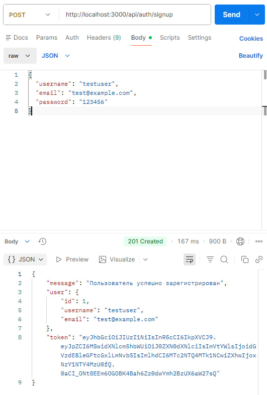
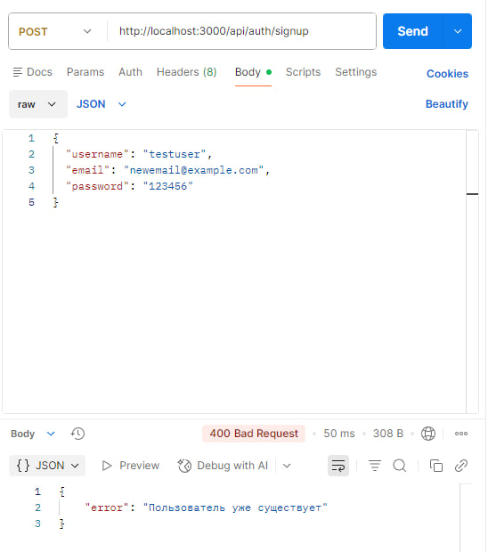
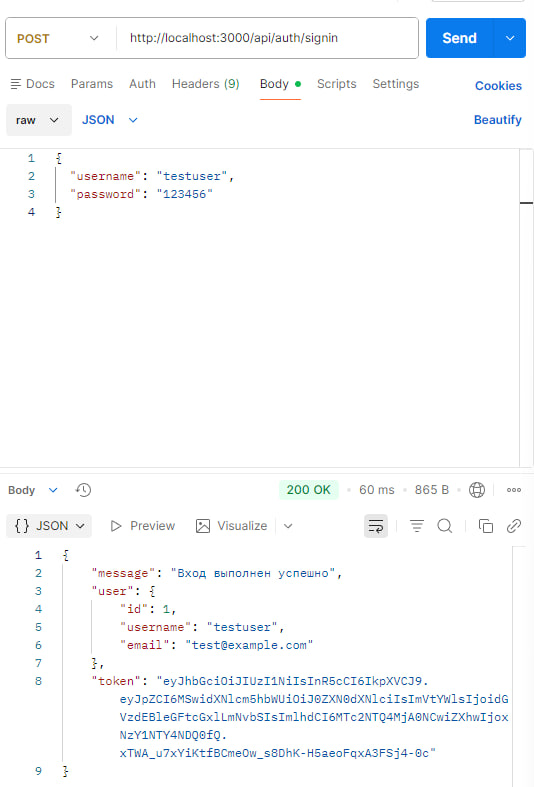
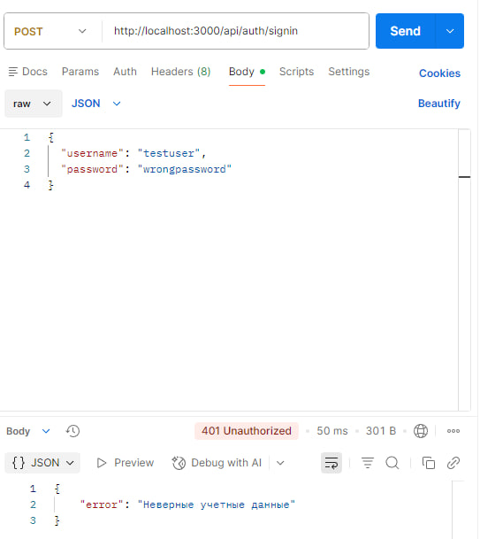
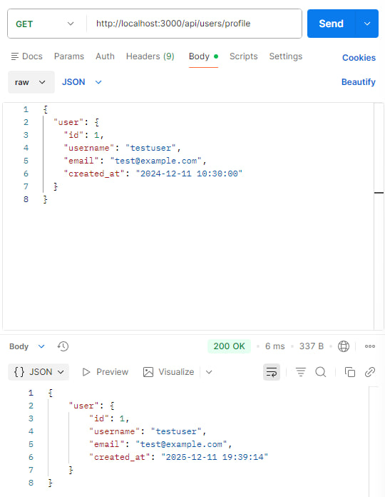
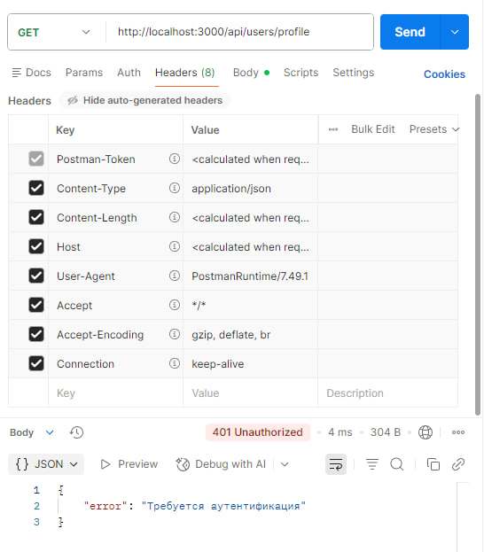
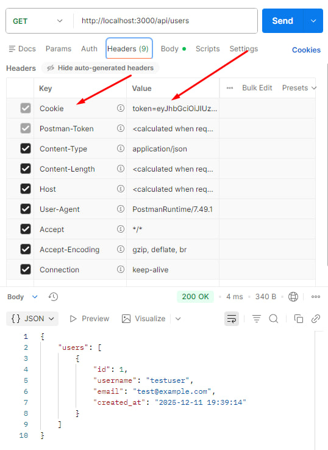
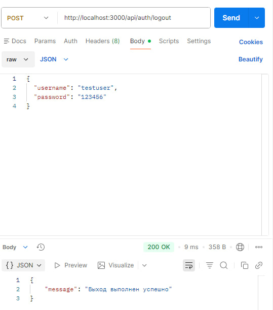

# Express.js Authentication API

Простое и структурированное Express.js приложение с аутентификацией, JWT токенами и SQLite базой данных.

## Возможности

-  Регистрация пользователей (Sign Up)
-  Вход в систему (Sign In)
-  Защищенные маршруты с JWT
-  Хеширование паролей с bcrypt
-  SQLite база данных
-  Middleware для аутентификации

## Быстрый старт

### Установка

```bash
# Установи зависимости
npm install

# Запусти сервер
npm run dev
```

Сервер запустится на `http://localhost:3000`

##  Структура проекта

```
project/
├── server.js                    # Главный файл приложения
├── package.json                 # Зависимости
├── users.db                     # SQLite база (создается автоматически)
│
├── config/
│   ├── database.js             # Конфигурация базы данных
│   └── jwt.js                  # JWT настройки
│
├── middleware/
│   └── authMiddleware.js       # Middleware для проверки токенов
│
├── controllers/
│   ├── authController.js       # Логика аутентификации
│   └── userController.js       # Логика работы с пользователями
│
└── routes/
    ├── authRoutes.js           # Маршруты аутентификации
    └── userRoutes.js           # Маршруты пользователей
```

##  API Endpoints

### Аутентификация (публичные)


#### Регистрация



#### Если пользователь уже существует:



#### Вход:



#### Если данные неверные:



### Пользователи (защищенные)

### Для доступа к защищенным маршрутам нужен JWT токен:
```
Authorization: Bearer YOUR_TOKEN_HERE
```

#### Получить профиль



### Получить всех пользователей

#### Получить всех пользователей, но без jwt


#### Включим наш jwt токен после аутентификация


#### Получим всех пользователей


### Выход


##  Безопасность

- **Пароли хешируются** с помощью bcrypt (10 раундов)
- **JWT токены** для аутентификации (срок действия 24 часа)
- **HTTP-only cookies** для защиты от XSS атак
- **Middleware** для защиты приватных маршрутов
- **Валидация данных** на стороне сервера

## Конфигурация

### JWT Secret

По умолчанию используется тестовый секрет.

В файле `config/jwt.js`:
```javascript
module.exports = {
  JWT_SECRET: process.env.JWT_SECRET || 'your-secret-key-change-in-production',
  JWT_EXPIRES_IN: '24h'
};
```

Или через переменные окружения:
```bash
export JWT_SECRET=your-super-secret-key
npm run dev
```

### База данных

SQLite база создается автоматически в корне проекта (`users.db`). 

## Зависимости

```json
{
  "express": "^4.18.2",
  "sqlite3": "^5.1.6",
  "bcrypt": "^5.1.1",
  "jsonwebtoken": "^9.0.2",
  "cookie-parser": "^1.4.6"
}
```

Это учебный проект. Задание в университете